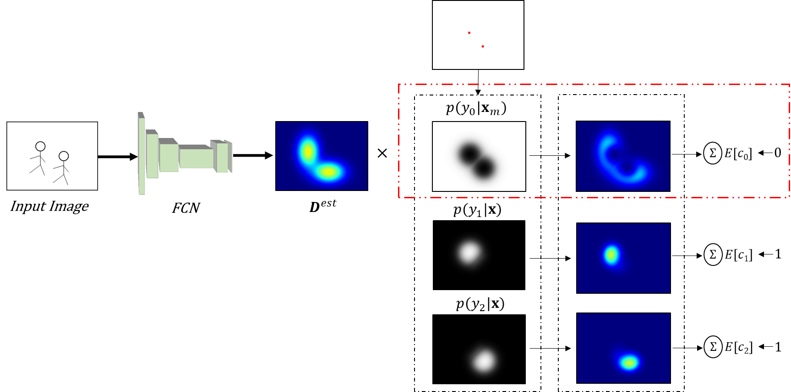
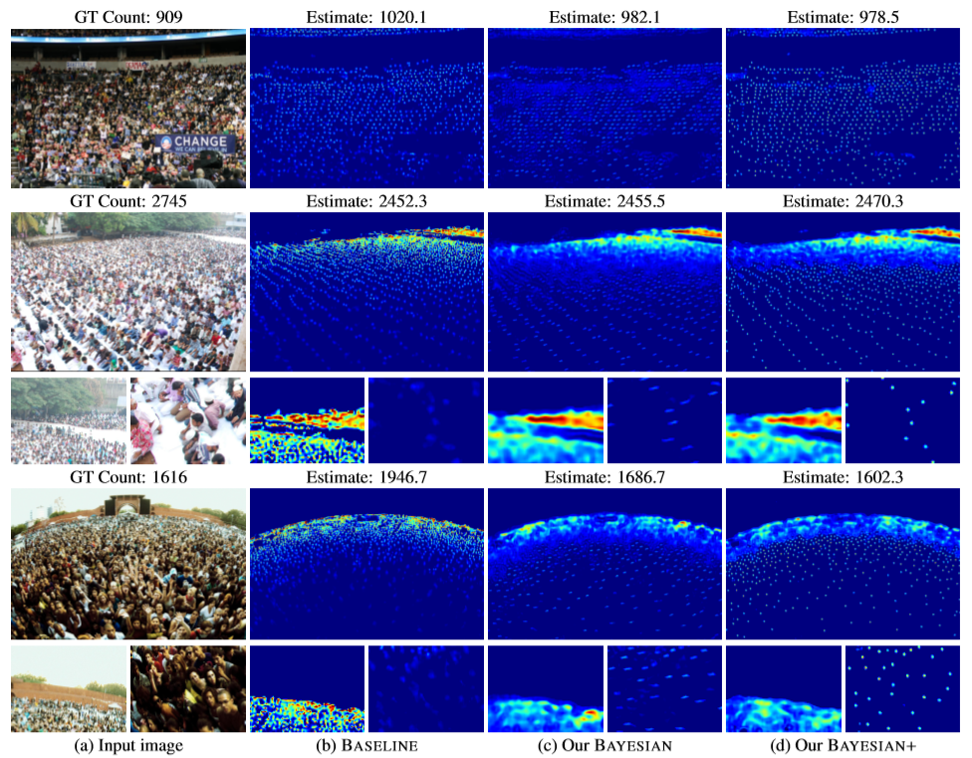

# Bayesian-Crowd-Counting
[Arxiv](https://arxiv.org/abs/1908.03684) | [CVF](http://openaccess.thecvf.com/content_ICCV_2019/papers/Ma_Bayesian_Loss_for_Crowd_Count_Estimation_With_Point_Supervision_ICCV_2019_paper.pdf) 
###  Official Implement of ICCV 2019 oral paper "Bayesian Loss for Crowd Count Estimation with Point Supervision"
####  ICCV 2019(oral)


## Visualization
# Bayesian


# Bayesian+



# Density



### Citation
If you use this code for your research, please cite our paper:

```
@inproceedings{ma2019bayesian,
  title={Bayesian loss for crowd count estimation with point supervision},
  author={Ma, Zhiheng and Wei, Xing and Hong, Xiaopeng and Gong, Yihong},
  booktitle={Proceedings of the IEEE International Conference on Computer Vision},
  pages={6142--6151},
  year={2019}
}
```

## Code

### Install dependencies

```
python -m pip install -r requirements.txt
```

This code was tested with python 3.6  

###  Train
To train SinGAN model on your own image, put the desire training image under Input/Images, and run

```
python main_train.py --input_name <input_file_name>
```

This will also use the resulting trained model to generate random samples starting from the coarsest scale (n=0).

To run this code on a cpu machine, specify `--not_cuda` when calling `main_train.py`

### Test
