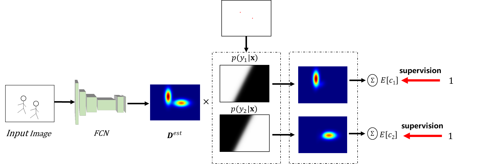

# Bayesian-Crowd-Counting （ICCV 2019 oral）
[Arxiv](https://arxiv.org/abs/1908.03684) | [CVF](http://openaccess.thecvf.com/content_ICCV_2019/papers/Ma_Bayesian_Loss_for_Crowd_Count_Estimation_With_Point_Supervision_ICCV_2019_paper.pdf) 
###  Official Implement of ICCV 2019 oral paper "Bayesian Loss for Crowd Count Estimation with Point Supervision"

## Visualization
### Bayesian



### Bayesian+


### Density


## Citation
If you use this code for your research, please cite our paper:

```
@inproceedings{ma2019bayesian,
  title={Bayesian loss for crowd count estimation with point supervision},
  author={Ma, Zhiheng and Wei, Xing and Hong, Xiaopeng and Gong, Yihong},
  booktitle={Proceedings of the IEEE International Conference on Computer Vision},
  pages={6142--6151},
  year={2019}
}
```

## Code

### Install dependencies

```
python -m pip install -r requirements.txt
```

This code was tested with python 3.6  

###  Train and Test

1、 Dowload Dataset UCF-QNRF [Link](https://www.crcv.ucf.edu/data/ucf-qnrf/)

2、 Pre-Process Data (resize image and split train/validation)

```
python preprocess_dataset.py --origin_dir <directory of original data> --data_dir <directory for processed data>
```

3、 Train model (validate on single GTX Titan X)

```
python train.py --data_dir <directory for processed data> --save_dir <directory for log and model>
```

4、 Test Model
```
python test.py --data_dir <directory for processed data> --save_dir <directory for log and model>
```
The result is slightly influenced by the random seed, but fixing the random seed (have to set cuda_benchmark to False) will make training time extrodinary long, so sometimes you can get a slightly worse result than the reported result, but most of time you can get a better result than the reported one. If you find this code is useful, please give us a star and cite our paper, have fun.

